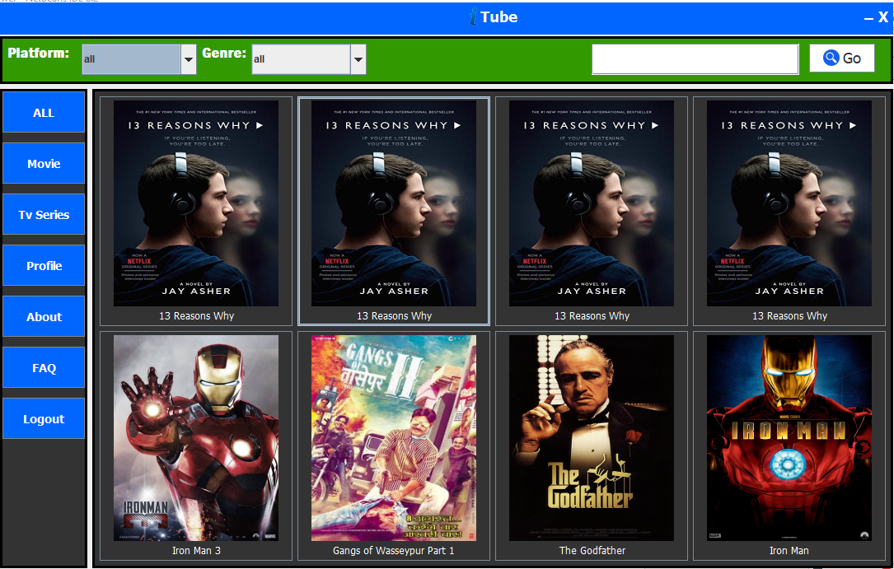

<h3>Overview:</h3>
The name of this project is ‘Online Movie and TV Series Viewer’. This is a software that will play various kinds of video content (TV Series, Films etc.) to paying users. The main purpose of this software is to provide high-quality streaming of the latest multimedia content to the users, as well as provide up-to-date information regarding the various content present in the software.
  
<h3> Platform:</h3> This software was programmed using Java. The software was coded in Netbeans IDE. For the purpose of managing the database in the software, MySQL was used.
 
 <figure>
 
<figcaption>Fig. - Online Movie & Tv Series Viewer.</figcaption>
</figure>

 <h4>Java Project By</h4>
<ul style="list-style-type:square">
  <li>SAGOR AHAMED</li>
<li>NABIL AHMED</li>
<li>Tazmilur Rahaman</li>
</ul>
<h4>FEATURES:</h4>
This software is embedded with various unique features. All of the features that are present within the software can be categorized into two portions:
<h6> User-side features</h6>

<ul style="list-style-type:circle">
<li>	A register page for opening a new account.</li>
<li>	A login page for logging into his/her account.</li>
<li>	The user home page, where the users would be able to view the latest content on display. Also, the users may view the content specifically according to platform/genre, if he/she chooses.</li>
<li>	A search bar to search for the content of his/her choice.</li>
<li>	A page for each individual content, displaying various information regarding the content (Runtime, Language, Cast, Genre etc.).</li>
<li>	An FAQ section for viewing the frequently asked questions, where users can find with ease the possible solutions to the problems they might encounter.</li>
<li>	An ‘About’ section displaying information regarding the creators of the software.</li>

</ul>

<h6> Admin-side features</h6>
The admins may have access to the following features within the software:
<ul style="list-style-type:circle">

<li>A login page for logging into his/her account.</li>
<li>	The admin home page, where the admin may run the admin panel.</li>
<li>Uploading new Movies/TV series to the software.</li>
<li>Sending the activation code to complete activation of accounts of users.</li>
<li>Updating/deleting the movie/tv series content.</li>
<li>Deleting unwanted users.</li>
<li>Promoting preferred users to admin.</li>
<li>Posting FAQ questions in the FAQ page.</li>
</ul>
